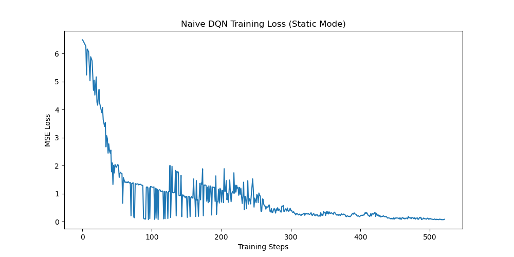
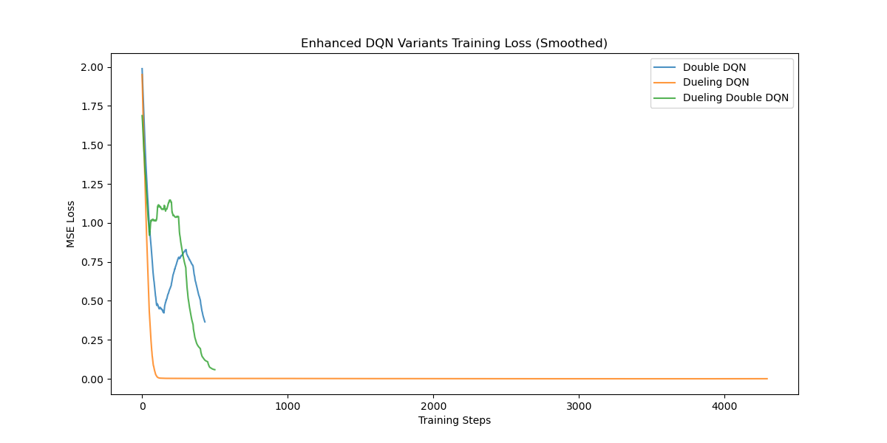
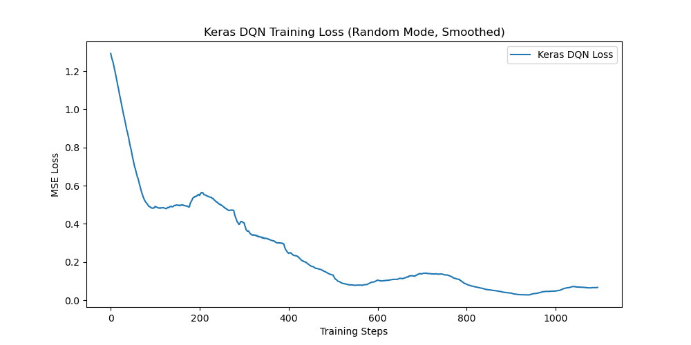

# HW3: DQN and its variants

## 1. HW3-1: Naive DQN (Static 模式)

### 簡易環境中的基礎 DQN 實作
在 `static`（靜態）的 Gridworld 環境中，所有的物件（目標 Goal、陷阱 Pit、牆壁 Wall、玩家 Player）的位置在不同回合之間都是完全固定的。這代表了一個高度決定性且簡單的馬可夫決策過程 (MDP)。

我們的基礎 DQN 模型使用了透過 PyTorch 建立的多層感知機 (MLP)。它將展平後的狀態（64 維，代表一個 $4 \times 4 \times 4$ 的張量，其中不同的通道表示不同物件的位置）映射到隱藏層，最後輸出 4 個 Q 值，分別對應（上、下、左、右）4 個動作。

基礎 DQN 的訓練目標是透過貝爾曼方程式 (Bellman Equation) 計算出目標 Q 值 (Target Q-value)，並持續最小化模型預測 Q 值與目標 Q 值之間的均方誤差 (MSE)：
$$ Y = R + \gamma \max_{a'} Q(S', a') $$

透過採用 $\epsilon$-greedy 策略，智能體 (Agent) 能夠逐漸從早期的隨機探索，轉變為利用已經學到的 Q 值來採取行動，進而穩定地避開陷阱與牆壁，順利抵達目標。

### 經驗回放池 (Experience Replay Buffer)
在訓練深度強化學習 (DRL) 神經網路時，如果直接按照時間順序學習連續的畫面，資料之間的高度相關性會導致「災難性遺忘 (Catastrophic Forgetting)」以及不穩定的梯度更新。為了改善這個問題，我們實作了 **經驗回放池 (Experience Replay Buffer)**。

- **運作機制：** 在每一個時間步，智能體與環境互動產生的轉移紀錄 $(S_t, A_t, R_{t+1}, S_{t+1}, \text{done})$ 會被儲存到一個有最大容量限制的 `deque` 佇列中。
- **採樣方式：** 網路不再直接學習最新的一筆轉移紀錄，而是改為每次從回放池中隨機抽取一個小批次（例如 200 筆紀錄）來進行訓練。
- **優勢與好處：** 這種做法打破了訓練樣本之間的時間相關性，並允許神經網路重複從過去的經驗中學習，大幅提升了樣本的使用效率，也讓訓練的 Loss 曲線變得更加穩定。

  
   
  <i>圖 1: Naive DQN 訓練損失曲線 (Static 模式)</i>

---

## 2. HW3-2: 增強型 DQN 變體 (Player 模式)

在 `player` 模式中，玩家的初始位置會被隨機放置，這要求模型必須具備更強的泛化能力，能夠在不同起點規劃出前往目標的路徑。我們實作並比較了以下變體：

- **Double DQN (雙重 DQN)：** 解決了標準 DQN 容易過度估計 Q 值 (Overestimation bias) 的問題。它透過將「動作選擇」與「動作價值評估」解耦來實現：使用線上網路 (Online Network) 來選擇下一個狀態的最佳動作，再用目標網路 (Target Network) 來評估該動作的實際 Q 值。
- **Dueling DQN (決鬥 DQN)：** 將神經網路架構拆分為兩個獨立的分支——一個用於估計狀態價值 $V(S)$，另一個用於估計每個動作的優勢值 $A(S,A)$。這在 Gridworld 中特別有用，因為很多時候只要知道「某個狀態本身是好是壞」就足夠了，而不必非得準確評估每一個動作的價值。

### 模型效能評估與比較
為了量化不同變體的改進效果，我們引入了測試機制，在訓練後對模型進行 50 場獨立測試，評估指標包括：
- **成功率 (Success Rate)：** 衡量模型導航至目標的能力。
- **平均步數 (Average Steps)：** 衡量路徑規劃的效率。透過比較發現，結合了 Double 與 Dueling 結構的模型通常能在隨機起點下展現出最穩定的成功率。

  
   
  <i>圖 2: 三種增強型 DQN 變體之訓練損失平滑曲線比較 (Player 模式)</i>

---

## 3. HW3-3: 結合訓練技巧的 Keras DQN (Random 模式)

`random` 模式是所有環境中最困難的，因為所有的物件都會隨機生成。我們將模型的實作轉移至 **Keras** 框架，並加入了關鍵的訓練技巧 (Training Tips) 來穩定學習過程：

1. **學習率排程 (Learning Rate Scheduling)：** 引入了 `ExponentialDecay` 排程器。這能讓學習率隨著訓練的進行從 `1e-3` 開始逐步遞減，確保模型在訓練初期能大步探索，而在訓練後期能小步微調，達成更平穩的收斂。
2. **梯度裁剪 (Gradient Clipping)：** 在 Adam 優化器中加入了 `clipnorm=1.0` 來限制梯度的最大範數。在隨機生成的網格環境中，模型很容易突然遭遇意料之外的 TD-error（例如：剛好出生在陷阱旁邊）；梯度裁剪可以有效防止這些極端情況引發的梯度爆炸，進而保護神經網路的權重不被破壞。

  
   
  <i>圖 3: Keras DQN 訓練損失平滑曲線 (Random 模式)</i>

